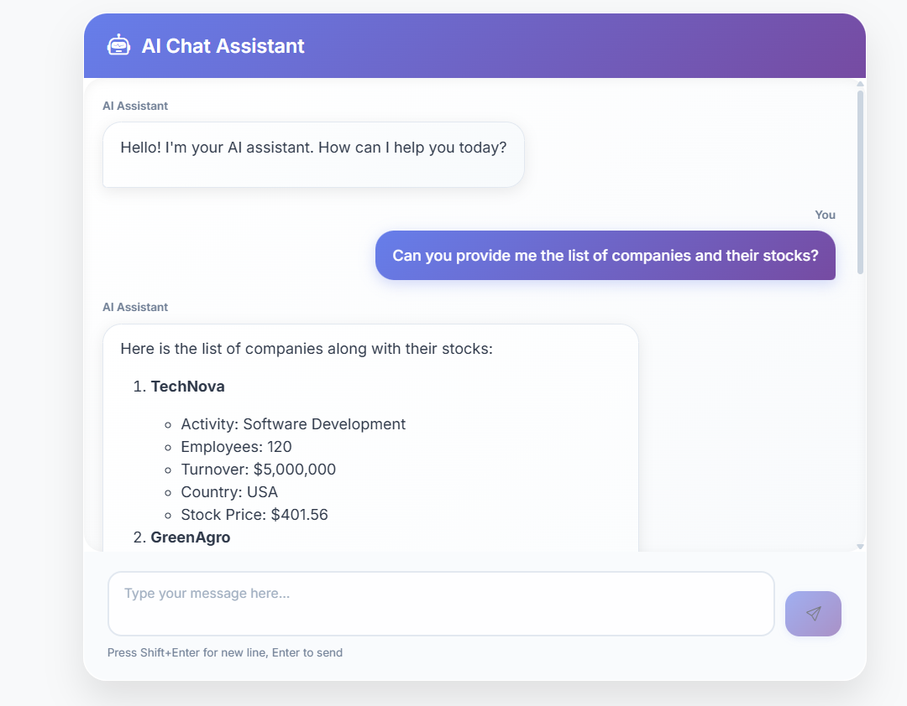

# MCP AI Chat Platform 🤖💬

A full-stack AI chat application demonstrating **Model Context Protocol (MCP)** integration with Spring Boot backend and Angular frontend.



## 🌟 Features

- **AI-Powered Chat Interface** - Interactive chat with AI assistant using Azure OpenAI
- **Model Context Protocol (MCP)** - Advanced tool integration and context management
- **Real-time Communication** - Streaming responses for better user experience
- **Multi-Service Architecture** - Java Spring Boot + Python FastMCP + Angular
- **Company & Stock Tools** - Built-in business data access via MCP tools
- **Modern UI/UX** - Responsive design with Bootstrap and custom styling
- **CORS-Enabled API** - Cross-origin support for frontend-backend communication

## 🏗️ Architecture

```mermaid
┌─────────────────┐    ┌─────────────────────────────────────┐    ┌─────────────────┐
│   Angular       │    │           Spring Boot               │    │   MCP Servers   │
│   Frontend      │◄──►│         MCP Client                  │◄──►│                 │
│                 │    │                                     │    │  • Java Tools   │
│  • Chat UI      │    │  • AI Agent (Azure OpenAI)         │    │  • Python Tools │
│  • Bootstrap    │    │  • REST Controllers                 │    │  • File System  │
│  • Responsive   │    │  • MCP Protocol Handler            │    │                 │
└─────────────────┘    └─────────────────────────────────────┘    └─────────────────┘
```

## 🚀 Quick Start

### Prerequisites

- **Java 17+**
- **Node.js 18+**
- **Python 3.13+**
- **Azure OpenAI API Key**
- **Git**

### 1. Clone the Repository

```bash
git clone https://github.com/MedBouhdida1/MCP-AI-Chat-Platform.git
cd MCP-AI-Chat-Platform
```

### 2. Backend Setup (Spring Boot)

```bash
cd Mcp-Back/Mcp-client

# Configure Azure OpenAI credentials
# Create application-local.properties or set environment variables:
# API_KEY=your_azure_openai_api_key
# Endpoint=your_azure_openai_endpoint  
# deployment=your_deployment_name

# Run the MCP client (main backend)
./mvnw spring-boot:run
```

The backend will start on `http://localhost:8066`

### 3. MCP Server Setup (Optional Tools Server)

```bash
cd ../Mcp-server
./mvnw spring-boot:run
```

The MCP server will start on `http://localhost:8899`

### 4. Python MCP Server Setup

```bash
cd ../python-mcp-server
pip install -r requirements.txt  # or use uv
python server.py
```

### 5. Frontend Setup (Angular)

```bash
cd ../../Mcp-Front
npm install
ng serve
```

The frontend will be available at `http://localhost:4200`

## 📁 Project Structure

```text
MCP-AI-Chat-Platform/
├── Mcp-Back/                   # Backend Services
│   ├── Mcp-client/            # Main Spring Boot Application
│   │   ├── src/main/java/org/example/mcpclient/
│   │   │   ├── agents/        # AI Agent Implementation
│   │   │   ├── Controllers/   # REST API Controllers
│   │   │   └── Config/        # CORS & Configuration
│   │   └── src/main/resources/
│   │       ├── application.properties
│   │       └── mcp-servers.json
│   ├── Mcp-server/            # MCP Tools Server
│   │   └── src/main/java/org/example/mcpserver/
│   │       └── tools/         # Stock & Company Tools
│   └── python-mcp-server/     # Python FastMCP Server
│       ├── server.py          # Employee Information Tools
│       └── pyproject.toml
└── Mcp-Front/                 # Angular Frontend
    ├── src/app/
    │   ├── components/chat/   # Chat Interface Components
    │   └── services/          # HTTP Services
    └── src/styles.css         # Global Styling
```

## 🛠️ Available MCP Tools

### Java MCP Server Tools

- `getCompanies()` - Retrieve list of all companies
- `getCompany(name)` - Get specific company details
- `getStockByCompanyName(name)` - Get current stock price

### Python MCP Server Tools

- `get_employee_info(name)` - Get employee information

### File System Tools

- Access to project files and directories via MCP protocol

## 🔧 Configuration

### Backend Configuration (`application.properties`)

```properties
# Server Configuration
server.port=8066

# Azure OpenAI Configuration
spring.ai.azure.openai.api-key=${API_KEY}
spring.ai.azure.openai.endpoint=${Endpoint}
spring.ai.azure.openai.chat.options.deployment-name=${deployment}

# MCP Client Configuration
spring.ai.mcp.client.type=sync
spring.ai.mcp.client.sse.connections.server1.url=http://localhost:8899
spring.ai.mcp.client.stdio.servers-configuration=classpath:mcp-servers.json
```

### Frontend Configuration

The Angular app automatically connects to the backend API at `http://localhost:8066/chat`

## 🎯 Usage Examples

### Basic Chat

```text
User: "Hello! Can you help me with company information?"
AI: "Hello! I'm your AI assistant. I can help you with company information, stock prices, and employee data. What would you like to know?"
```

### Company Queries

```text
User: "Can you provide me the list of companies and their stocks?"
AI: [Returns formatted list of companies with details including stock prices]
```

### Employee Information

```text
User: "Get employee information for John Doe"
AI: [Uses Python MCP server to retrieve employee data]
```

## 🚦 API Endpoints

| Method | Endpoint | Description |
|--------|----------|-------------|
| `POST` | `/chat` | Send message to AI assistant |
| `GET` | `/stream` | Server-sent events for streaming responses |

## 🧪 Testing

### Backend Tests

```bash
cd Mcp-Back/Mcp-client
./mvnw test
```

### Frontend Tests

```bash
cd Mcp-Front
ng test
```

## 🎨 UI Features

- **Modern Chat Interface** - Clean, responsive design
- **Real-time Messaging** - Instant AI responses
- **Markdown Support** - Rich text formatting in AI responses
- **Typing Indicators** - Visual feedback during AI processing
- **Message History** - Persistent conversation within session
- **Mobile Friendly** - Responsive design for all devices

## 🔮 Technology Stack

### Frontend

- **Angular 19** - Modern web framework
- **TypeScript** - Type-safe development
- **Bootstrap 5** - UI components and styling
- **RxJS** - Reactive programming
- **Marked** - Markdown parsing

### Backend

- **Spring Boot 3.5** - Java application framework
- **Spring AI** - AI integration framework
- **Model Context Protocol** - Tool integration standard
- **Azure OpenAI** - AI language model
- **Maven** - Dependency management

### MCP Servers

- **FastMCP** - Python MCP server framework
- **Spring AI MCP** - Java MCP server implementation

## 🤝 Contributing

1. Fork the repository
2. Create a feature branch (`git checkout -b feature/amazing-feature`)
3. Commit your changes (`git commit -m 'Add some amazing feature'`)
4. Push to the branch (`git push origin feature/amazing-feature`)
5. Open a Pull Request


## 🙏 Acknowledgments

- **Model Context Protocol** team for the innovative protocol
- **Spring AI** team for excellent AI integration
- **Angular** team for the robust frontend framework
- **Azure OpenAI** for powerful AI capabilities


---

**⭐ Star this repository if you find it helpful!**

Made with ❤️ using Model Context Protocol and AI
